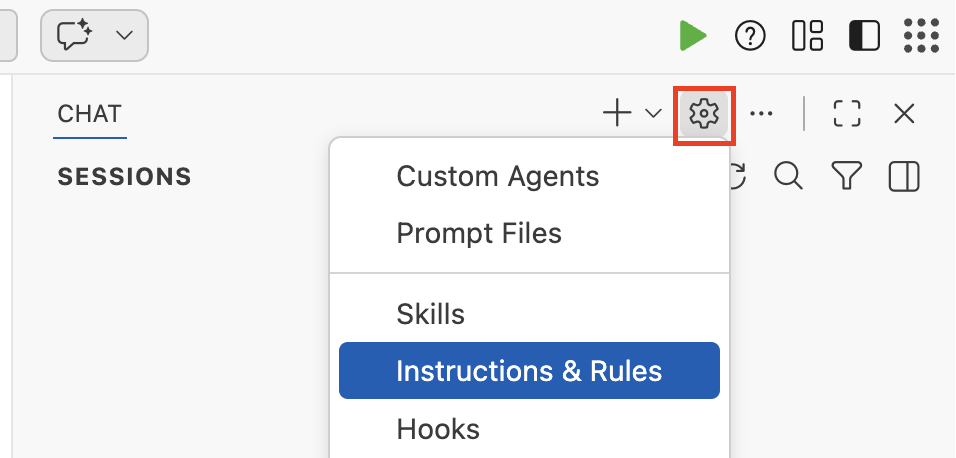
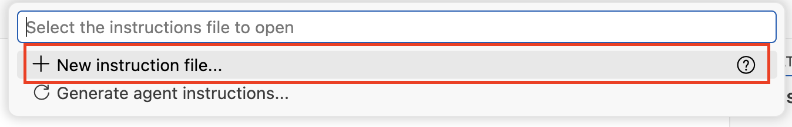
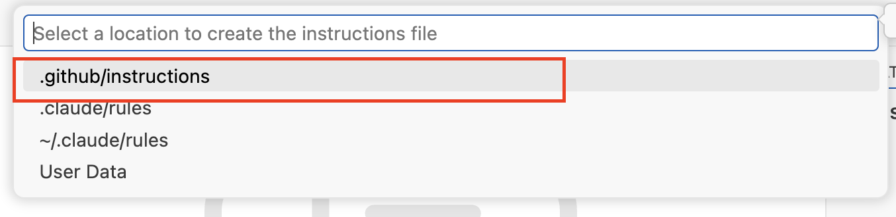
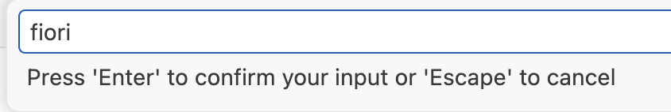
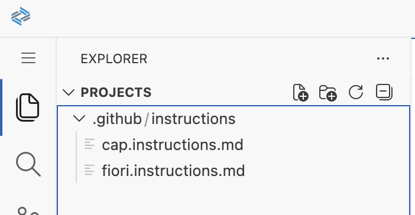

# Getting Started - Set up your AI Development Environment

As a participant of the hands-on tutorial, you should already be setup with access to the SAP Business Application Studio landscape below which you can use as your development environment.

## Access SAP Business Application Studio (SBAS)

1. Open https://lcapteched.eu10.build.cloud.sap/lobby in a new browser window or tab, which will ask you to login.

2. Open the [Login File for SBAS](../../SBASLogin.txt) and pick the login data for your assigned number.

3. Enter the data in the SBAS browser window or tab to complete your login.

    

## Access the Dev Space Manager

1. On the SAP Build landing page, click the **Switch Product** button in the top right corner and select **Dev Space Manager**.

    

## Open the Development Space

1. Make sure that the development space **AgenticAppDevelopment** has the status running. If stopped, click the **start** button.

    


> [!NOTE]
> For this hands-on session, please use only the **AgenticAppDevelopment** development space.

2. Once running, click the development space name to open it. This can take some time.

    

3. Click **OK** in the popup window to accept the tracking settings in the newly created dev space.

    

## Open your project folder

1. Select the **explorer icon** on the left side.

    

2. Select **Open Folder**.

    

3. Select the **projects** folder from the drop down.

    

4. Click **OK** and your window will reload.

    

5. Enable **Clipboard access** for the SBAS instance in the Chrome browser.

    

## Configure MCP servers

1. From the menu in the top-left corner, open the file mcp.json.
     

2. Copy file path `/home/user/.vscode/data/User/mcp.json` and click OK

    

   - Replace with below content.
     ```json
        {
            "servers": {
                "service-center-mcp": {
                    "command": "service-center-mcp"
                },
                "fiori-mcp": {
                    "timeout": 600,
                    "type": "stdio",
                    "command": "npx",
                    "args": [
                        "-y",
                        "@sap-ux/fiori-mcp-server"
                    ]
                },
                "cap-mcp": {
                    "disabled": false,
                    "timeout": 60,
                    "type": "stdio",
                    "command": "npx",
                    "args": [
                        "-y",
                        "@cap-js/mcp-server"
                    ],
                    "env": {}
                },
                "Framelink_Figma_MCP": {
                    "type": "stdio",
                    "timeout": 60,
                    "command": "npx",
                    "args": [
                        "-y",
                        "figma-developer-mcp",
                        "--figma-api-key=YOUR-KEY",
                        "--stdio"
                    ]
                }
            },
            "inputs": []
        }
     ```
     - Insert the personal access token created in the previous exercise into the Framelink_Figma_MCP configuration by replacing YOUR-KEY in --figma-api-key=YOUR-KEY with your token.

     - close file `mcp.json`.

5. Verify below mcp servers are installed.
    


## Configure Github Copilot (AI Client)

1. Open **Github Copilot**.

    

2. Before switching the LLM model, open Manage Model.
    

3. Hide all other LLMs except Claude Sonnet 4.5.
    

4. Select model **Claude Sonnet 4.5**.

    

## Configure Github Copilot Instructions/Rules

1. Open copilot settings and select **Instructions & Rules**
    

2. Select New instruction file and choose `.github/instructions`
    
    

3. Enter file name "fiori" and press Enter
    

4. Copy and paste below content

```
---
description: Load these instructions when the user is working on a SAP Fiori elements application.
---
## Rules for creation or modification of SAP Fiori elements apps

- When asked to create an SAP Fiori elements app check whether the user input can be interpreted as an application organized into one or more pages containing table data or forms, these can be translated into a SAP Fiori elements application, else ask the user for suitable input.
- The application typically starts with a List Report page showing the data of the base entity of the application in a table. Details of a specific table row are shown in the ObjectPage. This first Object Page is therefore based on the base entity of the application.
- An Object Page can contain one or more table sections based on to-many associations of its entity type. The details of a table section row can be shown in an another Object Page based on the associations target entity.
- The data model must be suitable for usage in a SAP Fiori elements frontend application. So there must be one main entity and one or more navigation properties to related entities.
- Each property of an entity must have a proper datatype.
- For all entities in the data model provide primary keys of type UUID (technical key) and ID (business key) fields.
- When creating sample data in CSV files, all primary keys and foreign keys MUST be in UUID format (e.g., `550e8400-e29b-41d4-a716-446655440001`).
- When generating or modifying the SAP Fiori elements application on top of the CAP service use the Fiori MCP server if available.
- When attempting to modify the SAP Fiori elements application like adding columns you must not use the screen personalization but instead modify the code of the project, before this first check whether an MCP server provides a suitable function.
- When previewing the SAP Fiori elements application use the most specific `npm run watch-*` script for the app in the `package.json`. If `npm run watch-*` script is already opened/running in a terminal, do not start another terminal window.
- MUST NOT use `npm start`, `npm run start`, `cds serve`, `cds-serve`, `sleep`.
- Must not open http://localhost:4004/ after lauching preview
- After launching the application stop and wait for user commands

```

5. Follow the same process (steps 1-3) to create another instruction file for CAP.

```
---
description: Load these instructions when the user is working on a SAP Fiori elements application for CAP projects.
---
- You MUST search for CDS definitions, like entities, fields and services (which include HTTP endpoints) with cds-mcp, only if it fails you MAY read \*.cds files in the project.
- You MUST search for CAP docs with cds-mcp EVERY TIME you create, modify CDS models or when using APIs or the `cds` CLI from CAP. Do NOT propose, suggest or make any changes without first checking it.
- When creating new CAP project ask cds mcp server. while using cds init, do not include any --add options (e.g., --add hana, --add sqlite, --add tiny-sample, etc.). Only use the plain form: cds init
- You MUST NOT use EDM JSON syntax for CDS.

```

6. Verify instructions are available on projects workspace.
    


## Summary

You have successfully set up your AI development environment with SAP Business Application Studio and configured github Copilot.

Continue to - [Exercise 2.0 - Create CAP Project and Fiori List Report App based on Figma Design](../ex2.0/README.md)

