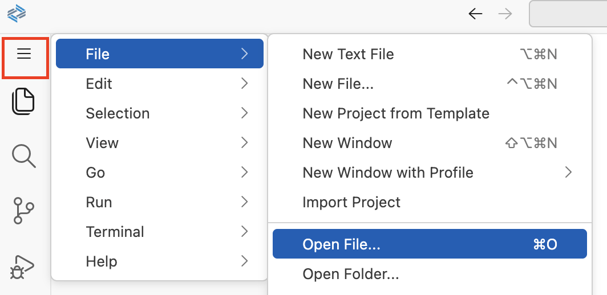
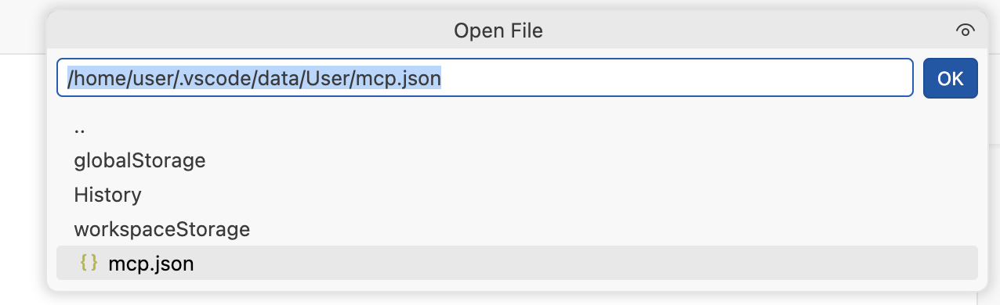
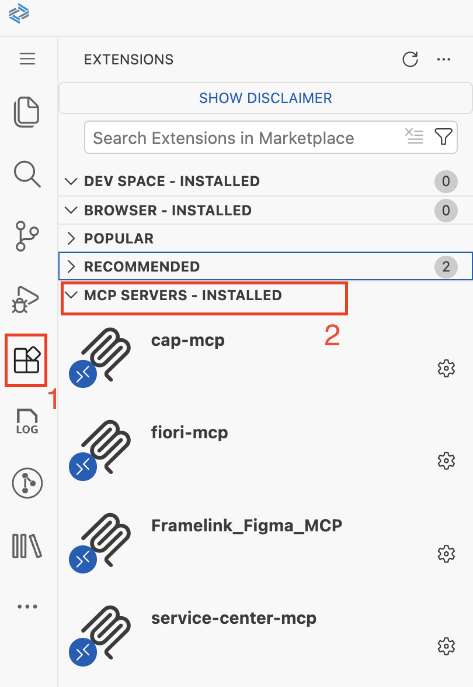
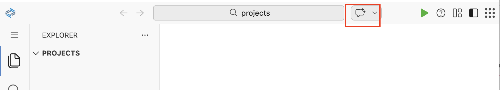
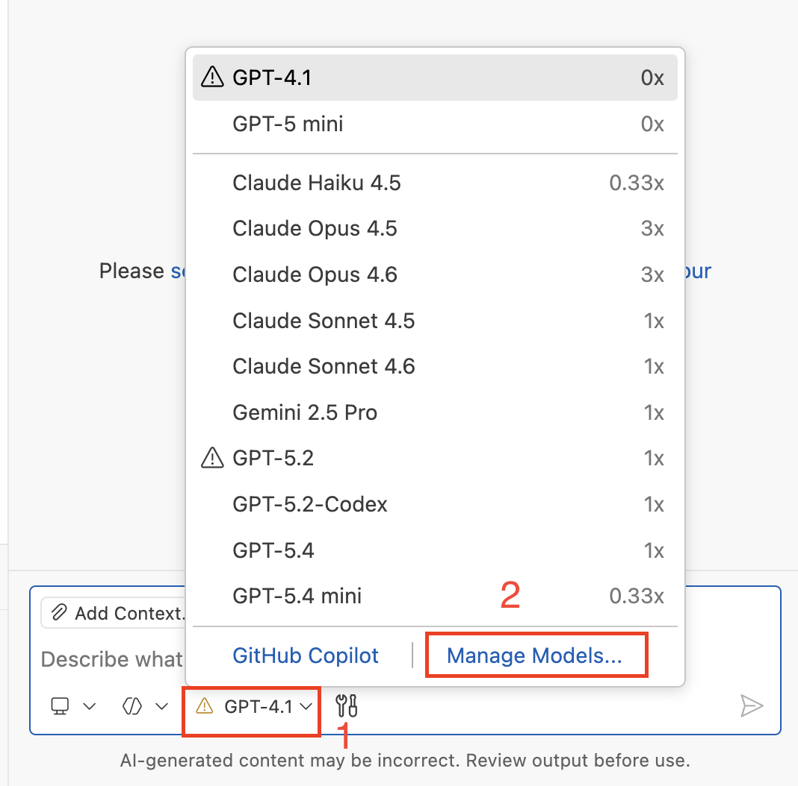
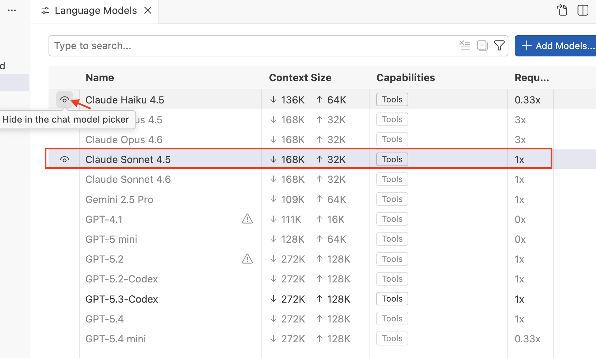
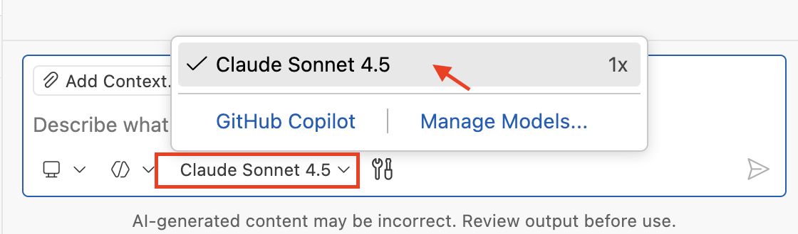

# Getting Started - Set up your AI Development Environment

As a participant of the hands-on tutorial, you should already be setup with access to the SAP Business Application Studio landscape below which you can use as your development environment.

## Access SAP Business Application Studio (SBAS)

1. Open https://lcapteched.eu10.build.cloud.sap/lobby in a new browser window or tab, which will ask you to login.

2. Open the [Login File for SBAS](../../SBASLogin.txt) and pick the login data for your assigned number.

3. Enter the data in the SBAS browser window or tab to complete your login.

    

## Access the Dev Space Manager

1. On the SAP Build landing page, click the **Switch Product** button in the top right corner and select **Dev Space Manager**.

    

## Open the Development Space

1. Make sure that the development space **AgenticAppDevelopment** has the status running. If stopped, click the **start** button.

    


> [!NOTE]
> For this hands-on session, please use only the **AgenticAppDevelopment** development space.

2. Once running, click the development space name to open it. This can take some time.

    

3. Click **OK** in the popup window to accept the tracking settings in the newly created dev space.

    

## Open your project folder

1. Select the **explorer icon** on the left side.

    

2. Select **Open Folder**.

    

3. Select the **projects** folder from the drop down.

    

4. Click **OK** and your window will reload.

    

5. Enable **Clipboard access** for the SBAS instance in the Chrome browser.

    

## Configure MCP servers

1. From the menu in the top-left corner, open the file mcp.json.
     

2. Copy file path `/home/user/.vscode/data/User/mcp.json` and click OK

    

   - Replace with below content.
     ```json
        {
            "servers": {
                "service-center-mcp": {
                    "command": "service-center-mcp"
                },
                "fiori-mcp": {
                    "timeout": 600,
                    "type": "stdio",
                    "command": "npx",
                    "args": [
                        "-y",
                        "@sap-ux/fiori-mcp-server"
                    ]
                },
                "cap-mcp": {
                    "disabled": false,
                    "timeout": 60,
                    "type": "stdio",
                    "command": "npx",
                    "args": [
                        "-y",
                        "@cap-js/mcp-server"
                    ],
                    "env": {}
                },
                "Framelink_Figma_MCP": {
                    "type": "stdio",
                    "timeout": 60,
                    "command": "npx",
                    "args": [
                        "-y",
                        "figma-developer-mcp",
                        "--figma-api-key=YOUR-KEY",
                        "--stdio"
                    ]
                }
            },
            "inputs": []
        }
     ```
     - Insert the personal access token created in the previous exercise into the Framelink_Figma_MCP configuration by replacing YOUR-KEY in --figma-api-key=YOUR-KEY with your token.

     - close file `mcp.json`.

5. Verify below mcp servers are installed.
    


## Configure Github Copilot (AI Client)

1. Open **Github Copilot**.

    

2. Before switching the LLM model, open Manage Model.
    

3. Hide all other LLMs except Claude Sonnet 4.5.
    

4. Select model **Claude Sonnet 4.5**.

    


## Summary

You have successfully set up your AI development environment with SAP Business Application Studio and configured github Copilot.

Continue to - [Exercise 2.0 - Create CAP Project and Fiori List Report App based on Figma Design](../ex2.0/README.md)

