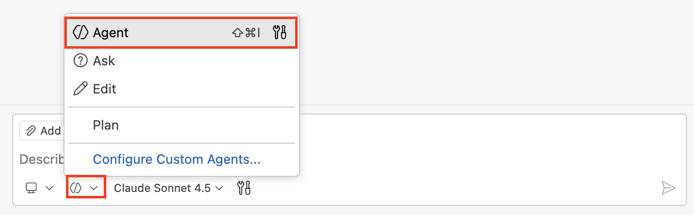
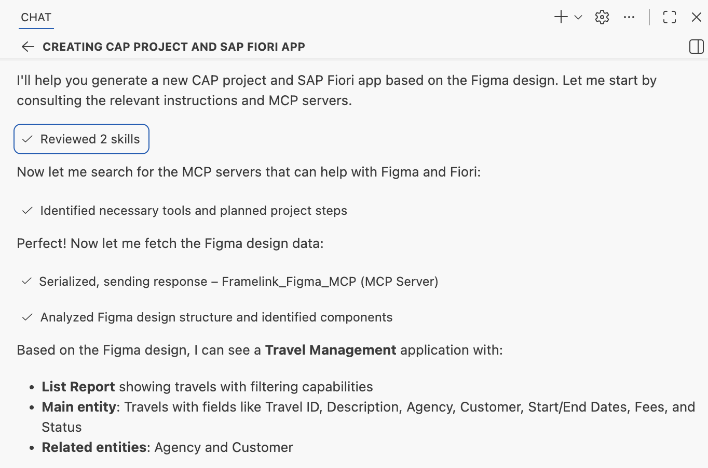
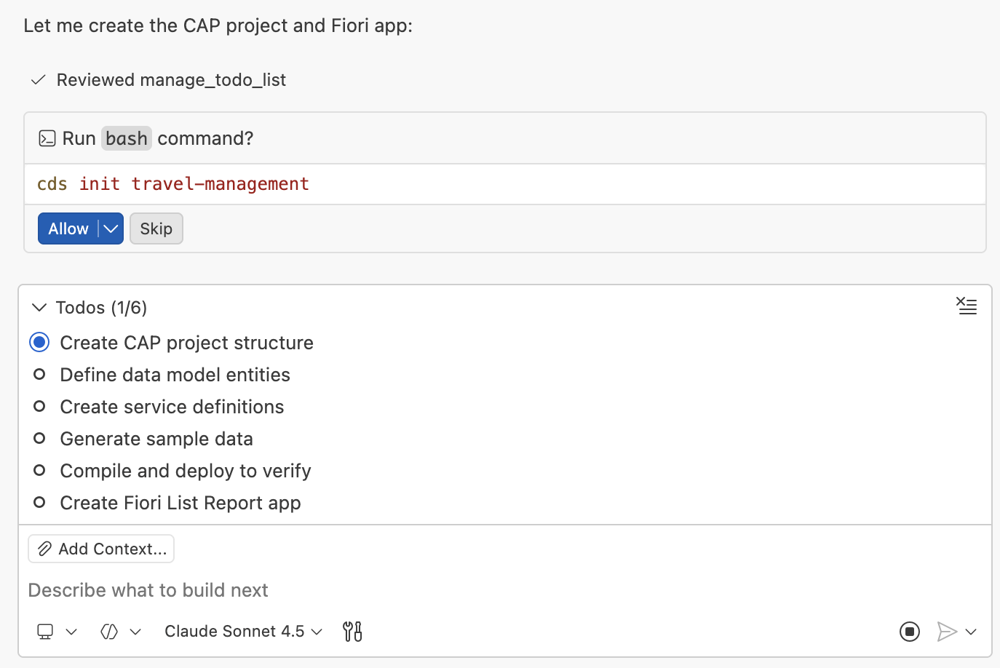
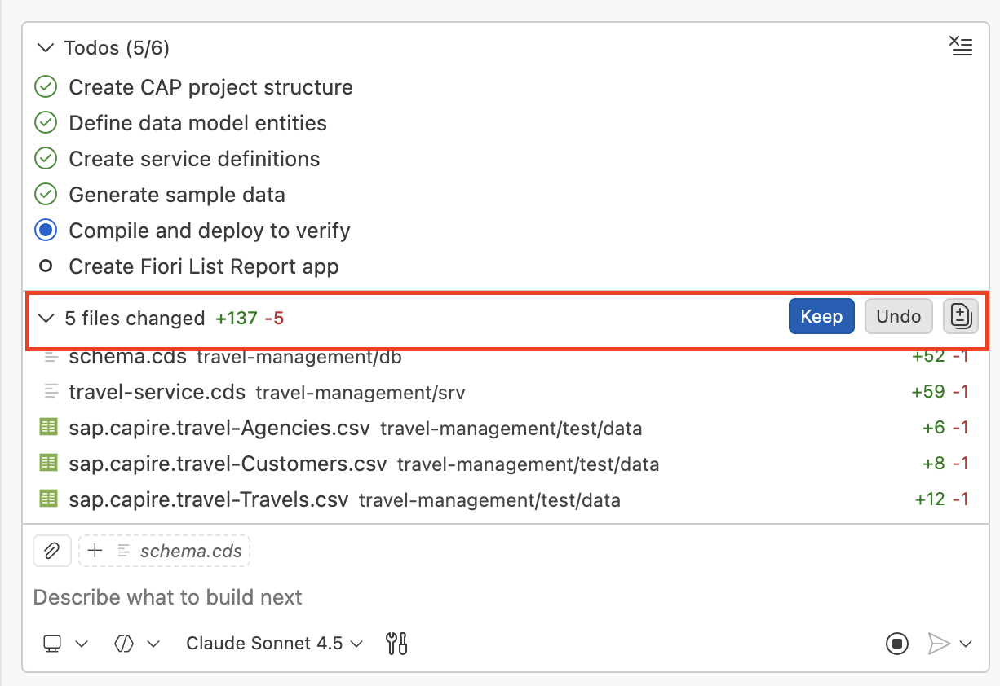

# Create CAP Project and Fiori List Report App based on Figma Design

1. In Copilot, choose **Agent mode**.
    

2. Copy and paste the following prompt into the task input (don't execute yet):

    ```
    Generate a new CAP project and SAP Fiori app based on the design from this link
    <insert_link_here> 

    Include technical key and business key for all entities.
    Consult MCP servers and read all instructions.
    ```

3. In the web browser tab with your Figma Design, select **Screen 1 - List Report**, right-click on it, and select **Copy/Paste as** → **Copy link to selection**.

   

4. Insert the link into the prompt text.

5. Press `Enter` to execute the task.

6. Copilot loads the instructions and skills, then uses the Figma MCP server to extract the design. 
    

7. Copilot generates a task list and requests permission to execute terminal commands. Click **Allow** to proceed.
    

> [!NOTE]
> The execution generated by Copilot may differ from the example shown above. The above image is just for reference.

8. As Copilot creates new files and content, click **Keep** to accept the changes.
    


9. After completing all the todos, Copilot confirms the successful creation of the CAP project and Fiori app.

10. Execute the prompt `/sap-fiori preview application`. The application should automatically open in your browser, displaying a travel list report application that matches the list report Figma Design.

    

## Troubleshoot

1. Application preview does not open automatically in the browser:

    - You can start the watch script manually:
        - Open the **package.json** file.
        - Right-click on the **watch** script and select **Run Script**.

        

2. `ENOSPC: System limit for number of file watchers reached`

    

    Add below script to **package.json** file:

    ```
    "cds": {
        "watch": {
            "excludes": [
                "**/node_modules",
                "**/target",
                "db/data.sqlite"
            ]
        }
    }
    ```
    

3. If HTTP port 4004 is already in use, press `Enter` to restart preview with a different port number.

> [!NOTE]
> Ensure that you either use 4004 or the system-assigned port for the preview. Check terminal instances and delete any duplicate processes running to preview the application.

4. If the application prompts for authentication, use username: `dummy` and password: `dummy`.

5. In the browser, if your application does not load or displays a blank page:

    - Open Developer Tools in your browser to check the error message by pressing `F12` or `Ctrl` + `Shift` + `I` (Windows/Linux) / `⌘` + `Option` + `I` (macOS).

        

    - For a 404 error, enter the prompt:
        ```
        Error: Could not load metadata: 404 Not Found
        ```
        - Press `Enter` and Copilot will fix the service URL path issue.

    - For a 200 error, enter the prompt:
        ```
        Check if the EDM JSON expression ($edmJson) syntax is incorrect and validate it using CAP MCP.
        ```
    - If the issue still exists, enter this prompt:
        ```
        Remove all instances of EDM JSON ($edmJson) expression syntax from the code.
        ```

## Summary

You have successfully created a CAP project with a Fiori List Report application based on the Figma Design.

Continue to - [Exercise 2.1 - Enable automatic data loading in List Report](../ex2.1/README.md)
