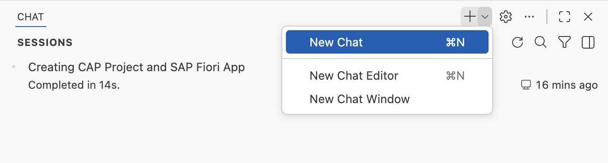

# Enable automatic data loading in List Report

1. Create a new chat.

    

2. Copy and paste the following prompt into the task input:
    ```
    I want the data to load automatically when I open the list report. Consult MCP servers.
    ```

3. Press `Enter` to execute the task.

4. Copilot executes the implementation plan.

5. When the task is complete, verify the data is loaded on the list report table without pressing the **GO** button.

## Summary

You have successfully enabled automatic data loading in the List Report, eliminating the need for users to press the **GO** button.

Continue to - [Exercise 2.2 - Add destination column to List Report table](../ex2.2/README.md)
