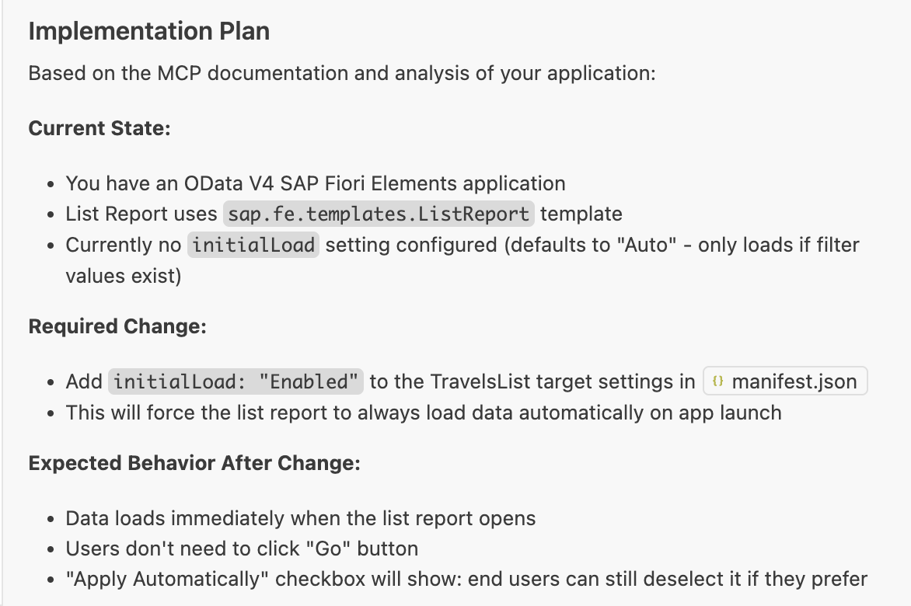
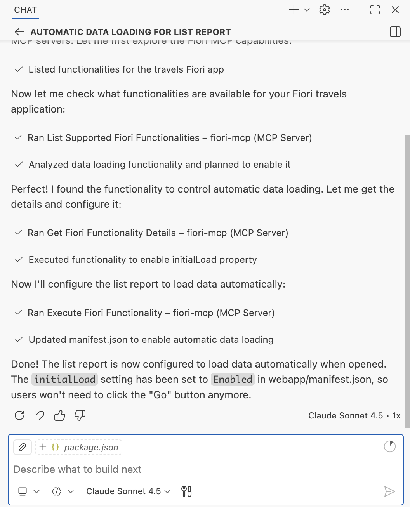

# Enable automatic data loading in List Report

1. Create a new chat.

    

2. Copy and paste the following prompt into the task input:
    ```
    I want the data to load automatically when I open the list report.
    Create implementation plan first, then proceed with confirmation.
    Consult MCP servers.
    ```

3. Execute the prompt. Copilot prepares an Implementation Plan.

    


4. Confirm the implementation plan by responding with "Yes" or "Proceed".

    

5. When the task is complete, verify the data is loaded on the list report table without pressing the **GO** button.

## Summary

You have successfully enabled automatic data loading in the List Report, eliminating the need for users to press the **GO** button.

Continue to - [Exercise 2.2 - Add destination column to List Report table](../ex2.2/README.md)
