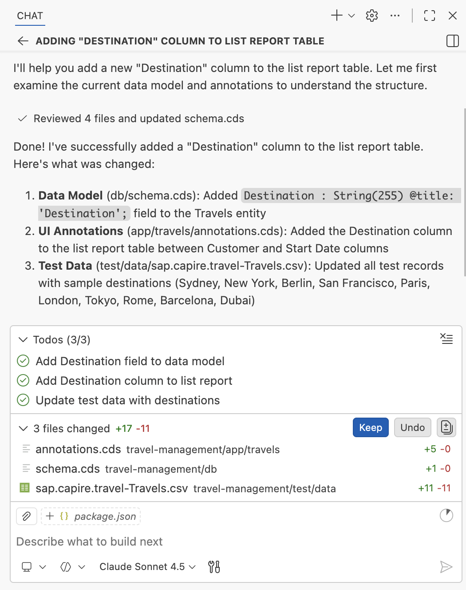

# Add destination column to List Report table

1. Create a new chat.

    

2. Copy and paste the following prompt into the task input:
    ```
    Create and add a new column "Destination" to the list report table
    ```

3. Press `Enter` to execute task.

    


4. After completion, confirm the destination column appears in the list report.

    

## Summary

You have successfully added a destination column to the List Report table.

Continue to - [Exercise 2.3 - Add Analytical Chart to List Report Page](../ex2.3/README.md)
