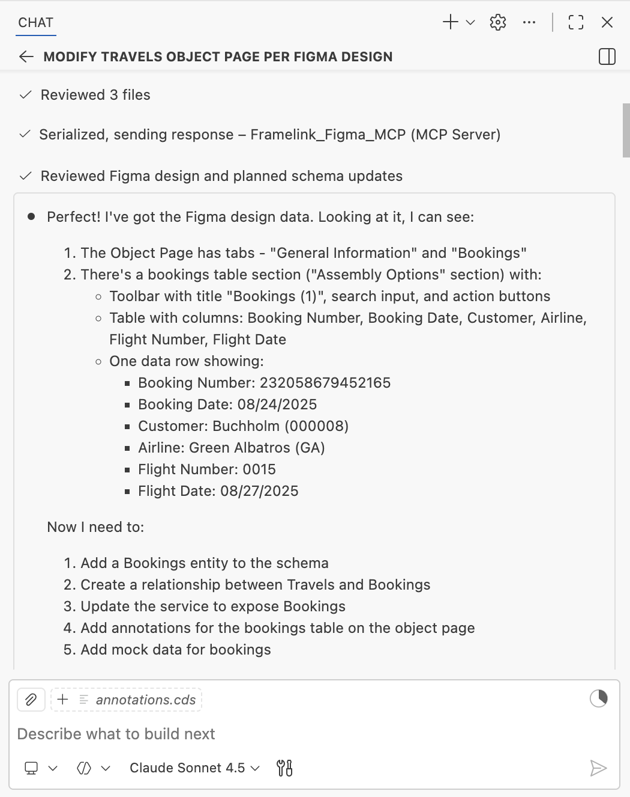
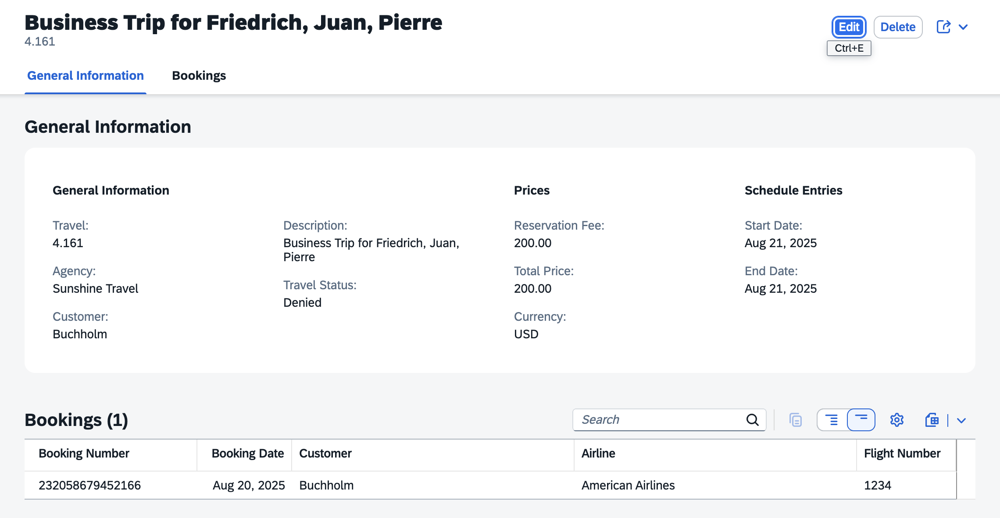

# Modify travel object page based on Figma Design

1. Create a new chat.

    

2. Enter the following prompt in the task input (don't execute yet):
    ```
    Modify the travel object page based on the Figma design:
    <insert_link_here>

    - Reorganize the General Information section into subsections following the Figma design
    - Align all fields, sections, and structure precisely with the Figma design
    - Add a bookings table section displaying flight booking details
    - Generate mock data for the bookings table.
    ```

3. In the web browser tab with your Figma Design, select **Screen 2 - Object Page**, right-click on it, and select **Copy/Paste as** → **Copy link to selection**.

4. Insert the link into the prompt text.

5. Press `Enter` to start the task.

6. Copilot will execute the task.
    

7. After completion, verify the object page in the application preview:
    - Verify the object page header contains both title and description.
    - Make sure the fields in the **General Information** section are arranged as per the Figma Design.

    

## Summary

You have successfully modified the travel object page based on the Figma Design, including the bookings table section.

Continue to - [Exercise 3.1 - Add Custom Section with RichTextEditor Building Block](../ex3.1/README.md)
