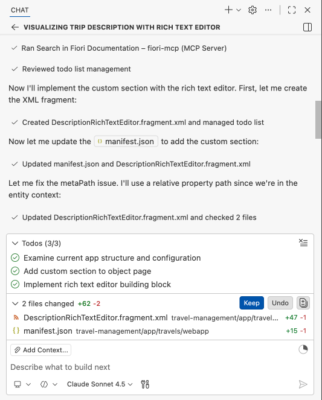

# Add Custom Section with RichTextEditor Building Block

1. Create a new chat.

    

2. Enter the following prompt in the task input:
    ```
    Your task is to visualize the description field of the trip as an rich text editor on the object page of the travel management app. Implement in two steps:
     1. Add a custom section at the last position of the object page
     2. Use the rich text editor building block in the new section to show the description field. Ensure each button group for the Rich text editor has an ID
     Follow the workspace rules and use MCP servers.

    ```

3. Press `Enter` to start the task.

4. Copilot will execute the task.
    

5. After completion, confirm that the travel description section is visible on the travel object page.

6. Click the **Edit** button in the top right corner.

7. In the travel description section, select some text and apply bold formatting.

8. Click **Save** and verify that the object has been saved successfully.

    

## Troubleshoot

1. No **Edit** button on the travel object page. Execute the prompt:
    ```
    Enable draft mode for travel entity
    ```

## Summary

You have successfully added a custom section with a RichTextEditor building block to the travel object page.

Continue to - [Exercise 4.0 - Add Object Page for Booking Details](../ex4.0/README.md)
