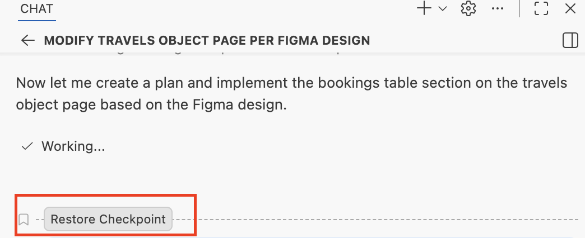

## Troubleshooting Guide


Sl no | Troubleshooting Guide
---------|----------
 1 | [How to restore files and chat to a checkpoint](#1-how-to-restore-workspace-and-chat)
 2 | [MCP server connection failure](#2-mcp-server-connection-failure)
 3 | [CDS compilation error](#3-cds-compilation-error) 
 4 | [Hard reload browser](#4-hard-reload-browser)


---

### 1. How to restore workspace and chat

   

---

### 2. MCP server connection failure
   Open mcp.json (/home/user/.vscode/data/User/mcp.json) and verify the MCP configuration.
   Refer to [MCP configuration](../ex1.6/README.md#configure-mcp-servers).

---

### 3. CDS compilation error
   - If you notice a CDS compilation error in the console, copy and paste the error message into the task input.

      ```
      [ERROR] srv/travel-service.cds: Composition in draft-enabled entity can't lead to another entity with “@odata.draft.enabled” (in entity:“TravelService.Travel”/element:“to_Booking”)
      ```

   - Press `Enter`.

   - Copilot removes the `@odata.draft.enabled` annotation applied on the booking entity from the CDS service.

---

### 4. Hard reload browser

- If the application is not loading correctly or changes are not reflected in the browser preview:
  
  - Open Developer Tools by pressing `F12`
  - Long press the browser refresh button for 2-3 seconds until a dropdown menu appears
  - Select "Empty Cache and Hard Reload" from the dropdown menu

  

  This clears the browser cache and forces a complete reload of the page, ensuring all changes are properly displayed.

---

   
